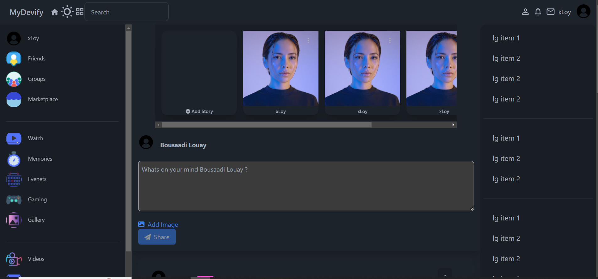
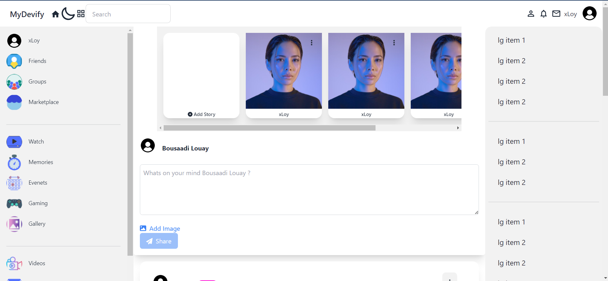
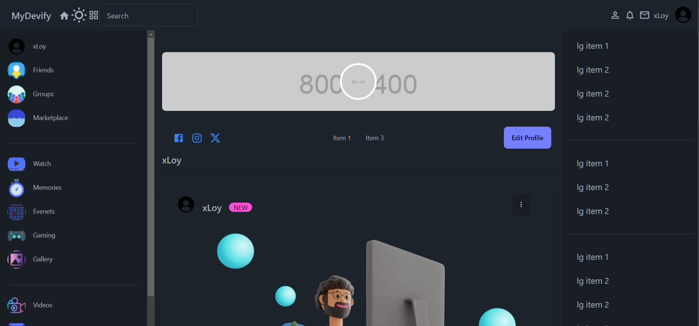
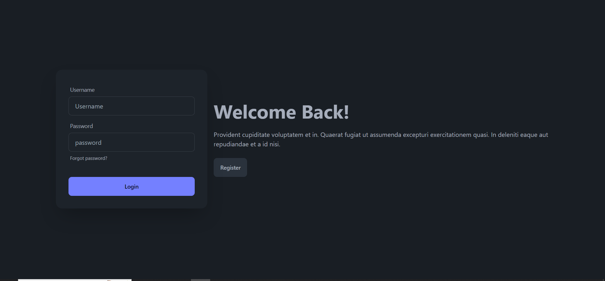
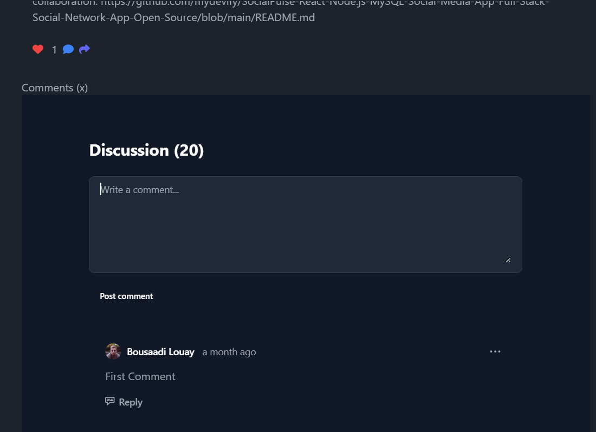
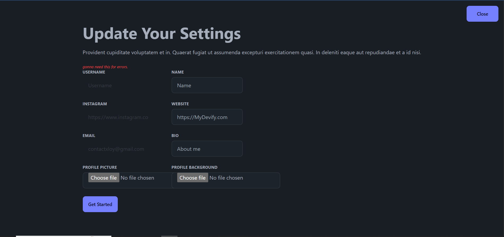
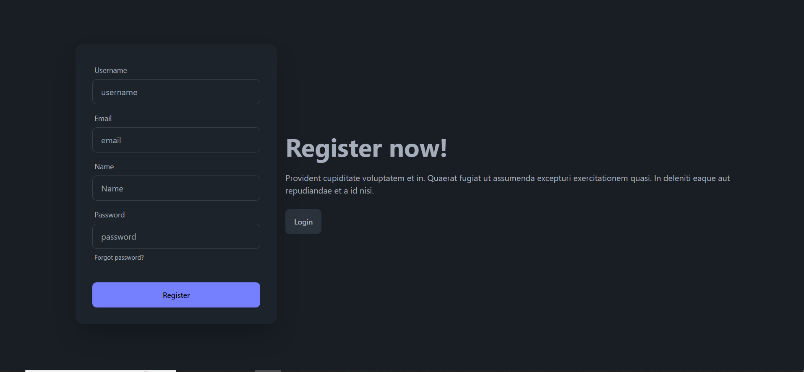
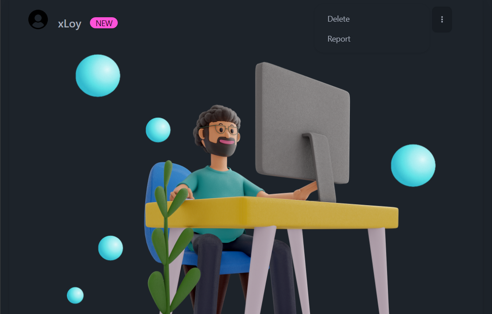

# Uks15 Social

A full-stack social networking platform built with React, Node.js, Express, and MySQL. Combines a Facebook-style feed and navigation shell with Instagram-style stories, image-first posts, and a clean green brand system.

[](https://uks15-social.netlify.app)
[](https://github.com/Ujas-Sheta/uks15-social)

<!-- ---

## Screenshots

| Dark Mode Feed | Light Mode |
|---|---|
|  |  |

| Profile Page | Login |
|---|---|
|  |  |

| Likes & Comments | Edit Profile |
|---|---|
|  |  |

| Register | Manage Posts |
|---|---|
|  |  |

---

## Features

**Authentication & Accounts**
- User registration and login with JWT cookie authentication
- Private accounts with follow request and accept/reject flow
- Edit profile — name, bio, website, profile picture, cover photo
- Delete account — permanently removes all posts, messages, and data
- Light and dark mode toggle

**Feed & Posts**
- Home feed showing your posts, followed users, and public accounts
- Create text posts, image posts, and video posts (MP4, WebM, OGG, MOV up to 50 MB)
- Image preview before posting
- Multiple reaction types — Like, Love, Haha, Wow, Sad
- Comment on posts
- Repost to your feed
- Save posts to a private collection
- Delete your own posts
- Paginated feed — 20 posts per page

**Social**
- Follow and unfollow users
- Follow requests for private accounts
- Connections page with pending requests
- Search users from the header
- Messaging between connected users
- Notification system for follows, reactions, comments, and messages
- Clickable notifications routing to the relevant profile or post
- Full-screen story viewer with auto-advance

**Discovery**
- Communities — create and browse focused groups
- Uks15 Market — local marketplace listings
- Clips — short video feed with playable video cards
- Events — create and discover upcoming events
- Search and filter toolbar on all discovery pages

---

## Tech Stack

**Frontend**


- React Router DOM for client-side routing
- TanStack React Query for server state and caching
- Custom CSS variables for green brand system and theming

**Backend**


- mysql2 with connection pooling
- bcryptjs for password hashing
- multer for image and video uploads
- cookie-parser and dotenv
- In-memory rate limiting on auth routes

---

## Project Structure

```
uks15-social/
├── API/
│   ├── controllers/       # auth, posts, users, likes, comments,
│   │                      # relationships, messages, notifications,
│   │                      # stories, saved, features
│   ├── routes/            # Express route definitions
│   ├── migrations/        # SQL migration files (001–005)
│   ├── scripts/           # Seed scripts
│   ├── connect.js         # MySQL connection pool
│   └── index.js           # Express app entry point
│
├── frontend/
│   └── src/
│       ├── components/    # Navbar, Leftbar, Rightbar, Post, Share,
│       │                  # Stories, Comments, Update, etc.
│       ├── context/       # AuthContext, ToastContext
│       ├── pages/         # Home, Profile, Login, Register, Messages,
│       │                  # Notifications, Connections, Saved, Settings
│       ├── utils/         # upload.js, notificationLink.js
│       └── App.jsx
│
├── ShowCase/              # Screenshots
└── mydevify_social.sql    # Base database schema
```

---

## Local Setup

### 1. Clone the repo

```bash
git clone https://github.com/Ujas-Sheta/uks15-social.git
cd uks15-social
```

### 2. Set up the database

```bash
mysql -u root -p -e "CREATE DATABASE mydevify_social;"
mysql -u root -p mydevify_social < mydevify_social.sql
mysql -u root -p mydevify_social < API/migrations/001_notifications.sql
mysql -u root -p mydevify_social < API/migrations/002_private_accounts.sql
mysql -u root -p mydevify_social < API/migrations/003_social_features.sql
mysql -u root -p mydevify_social < API/migrations/004_feature_media_type.sql
mysql -u root -p mydevify_social < API/migrations/005_saved_posts_reactions.sql
```

### 3. Backend

```bash
cd API
npm install
copy .env.example .env   # fill in your values
npm run seed             # seed demo users and posts
npm start                # runs on http://localhost:8800
```

### 4. Frontend

```bash
cd frontend
npm install
copy .env.example .env   # fill in your values
npm run dev              # runs on http://localhost:5173
```

---

## Demo Login

```
Username: xLoy
Password: 123456789
```

Or register a new account from the register page.

---

## Environment Variables

**`API/.env`**

```env
PORT=8800
CLIENT_URL=http://localhost:5173
DB_HOST=localhost
DB_PORT=3306
DB_USER=root
DB_PASSWORD=your_password
DB_NAME=mydevify_social
JWT_SECRET=your_secret_key_here
# DB_SSL=true   ← uncomment when using a cloud database
```

**`frontend/.env`**

```env
VITE_API_URL=http://localhost:8800/api
VITE_UPLOAD_URL=http://localhost:5173
```

---

## Seed Scripts

```bash
# Seed demo users and content
npm run seed

# Seed 5 real-world celebrity accounts with posts, market, events, clips and stories
npm run seed:celebs

# View all database tables and row counts
node scripts/show-db.js
```

---

## Deployment

| Service | Purpose |
|---|---|
| [Netlify](https://netlify.com) | Frontend (React/Vite) |
| [Render](https://render.com) | Backend (Node/Express) |
| [Aiven](https://aiven.io) | MySQL Database |

Set `VITE_API_URL` and `VITE_UPLOAD_URL` on Netlify to point to your Render backend URL.
Set `DB_SSL=true` on Render when connecting to Aiven or any cloud MySQL.

---

## License

MIT -->
